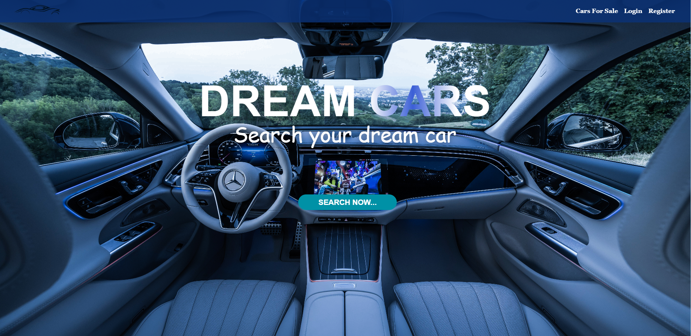

# Dream-Cars

## :pencil2: About The Project

This is my project for the React course in SoftUni. It was crated with HTML, CSS, JavaScript, React, and practice server fomr SoftUni. It for users easly Buy and Sale cars.

<br/>



<br/>

## Installation and usage
 
**Clone respository:**
 
 ```
 https://github.com/mehmedayt/react-exam-project.git
 ```
 
 * To run client app
   <br/>
 ```
    cd client 
    npm install
    npm run dev
 ```
 * To run server app
    <br/>
 ```
    cd server
    npm install
    node ./server.js
 ```
 
 <br/>

# :earth_asia: Public

The guest pages are:

* Home
* Login
* Register
* Car for sale
* Details

# :lock: Private

The loggrd-in users are:

* Sell my car
* **Functionaly**
  <br/>
  :white_medium_small_square: Car - create, edit, delete.
    <br/>
  :white_medium_small_square: User - edit, delete.

# :computer:  Built With

## Back-end

- Softuni Practice Server

## Front-end

- [HTML5](https://developer.mozilla.org/en-US/docs/Glossary/HTML5)
- [CSS](https://developer.mozilla.org/en-US/docs/Web/CSS)
- [React](https://reactjs.org/)
- [Font Awesome](https://fontawesome.com/v5.15/how-to-use/on-the-web/using-with/react)
